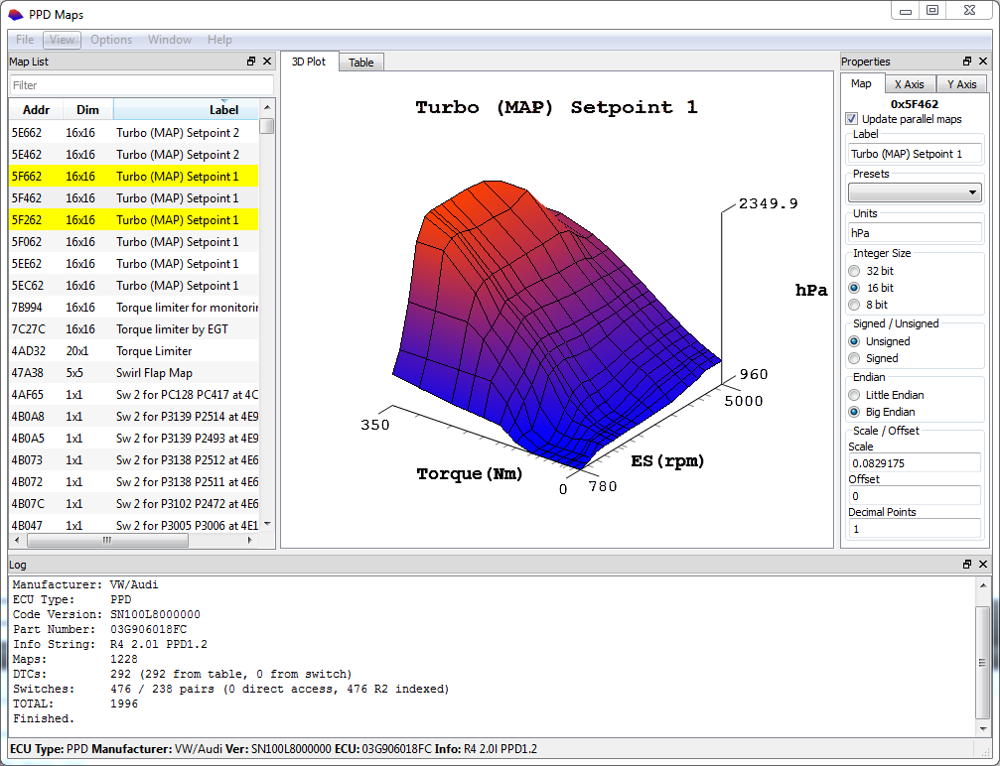
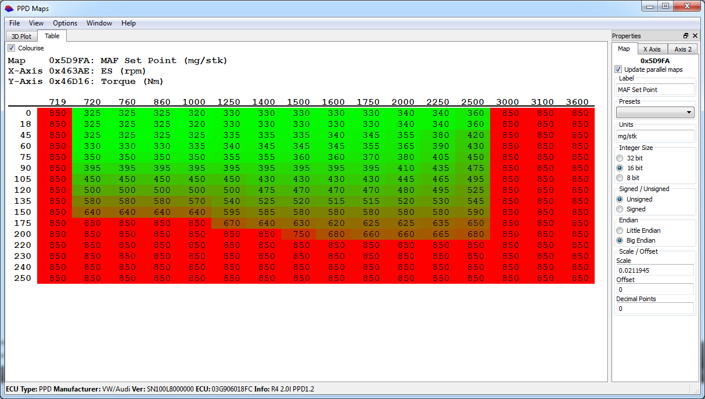

PPD Maps is open source (GPLv3) software for detecting maps in Siemens ECU dumps. Supported ECUs are PPD, SID206 &
SID803A. There is partial support for SID803 and barely working support for SID201

The software will identify the corresponding axes for each map and also give a list of DTC/P-codes. It will also find
single byte switches to turn off DTCs

The file must be a full read of the ECU i.e. BDM. A partial read using a tool such as MPPS or similar will not work.

Export to XDF format is possible, please use the latest [TunerPro](http://www.tunerpro.net/) software to open it. Maps
can be imported into [WinOLS](http://www.evc.de/en/product/ols/software/default.asp)
via the A2L ([ASAP2](https://www.vector.com/vi_datadescription_ecu1_en.html)) export function

## Screenshots

## Download PPD-Maps

This program comes without warranty of any kind, use at your own risk.

* [Windows binary - Version 1.3.2](https://github.com/jazdw/jazdw.github.io/releases/download/v1.0.0/PPD-Maps-1.3.2-Windows.zip)
  * Released 22 October 2012
  * ~2.9MB
* [Ubuntu 12.04 binary - Version 1.3.0](https://github.com/jazdw/jazdw.github.io/releases/download/v1.0.0/PPD-Maps-1.3.0-Ubuntu.12.04.gz)
  * Released 5 October 2012
  * ~150KB
* [Ubuntu 10.04 binary - Version 1.3.0](https://github.com/jazdw/jazdw.github.io/releases/download/v1.0.0/PPD-Maps-1.3.0-Ubuntu.10.04.gz)
  * Released 5 October 2012
  * ~150KB

### Other files
* [Changelog](files/changelog.txt)
* [Sample BDM Files (7z)](https://github.com/jazdw/jazdw.github.io/releases/download/v1.0.0/BDM-Samples.7z) (~2.3MB)
* [Sample BDM Files (Zip)](https://github.com/jazdw/jazdw.github.io/releases/download/v1.0.0/BDM-Samples.zip) (~7.6MB)
* [Test results](files/VER1.3.0-SVN135.txt)

### Ubuntu prerequisites

`sudo apt-get install libqtcore4 libqtgui4 libqt4-opengl libglu1-mesa libqwtplot3d-qt4-0`

## Source code

[https://github.com/jazdw/ppd-maps](https://github.com/jazdw/ppd-maps)

## Information on DTCs and switches

For more information about how this software works please see the [DTC and switch page](ppd_sid_dtcs.md).

