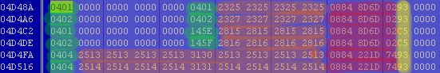
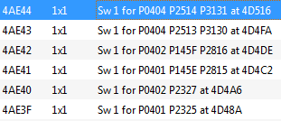

# PPD/SID DTCs and Switches

This is a quick write-up of my understanding of the DTCs and switches in the Siemens PPD and SID803/SID803A/SID206 ECUs.
I will be working with the PPD SN100L8000000 file from the [sample BDM files](files/BDM-Samples.7z).

## DTC table entries

There is a table in each file which contains Diagnostic Trouble Codes (DTCs). If you view the table in hex you will see
they match up with P-Codes i.e. codes for the powertrain.

Try and find the SAE J2012 standards document on the net, it will explain how all the codes work and their definitions.
P0xxx, P2xxx & P3xxx codes are generic codes, P1xxx codes are "manufacturer controlled" codes i.e. VW specific in this
case. You might want to have a look at this site too http://www.dtcsearch.com/

So in this file the table starts at 0x4CB06 and is 14 columns wide. We will work through finding and disabling the DTCs
for the EGR. Shown below is a section of the table showing DTCs P0401, P0402 and P0404 which are for EGR flow low, high
and control circuit range/performance faults respectively. P145E and P145F must be the matching VW specific codes.



I am not sure of the meaning of the orange highlighted entries because if they were P-Codes they dont match up with the
other P-Codes (green highlighted) on the same line. I also have no idea what the red highlighted values are.

The yellow highlighted values are error class codes, these are what triggers a MIL (Malfunction Indicator Light) on your
dash. I presume that each value corresponds to a different light. If you zero out this 1-byte value you will see that
the MIL will not show but the fault will still show up in VCDS.

If you zero the entire line you will find VCDS will still show a fault but wont be able to identify it, it shows up as "
0000 - Unknown fault" or something like that.

## Switches

Each DTC table entry has two 1-byte "switches" associated with it. These can be identified by my "PPD-Maps" software (
see main page).

The first switch (which I labeled Sw1) always seems to have a value of 0, 1 or 2. The second "switch" (Sw2) has values
which range up to 255 (0xFF), so I think it might actually be some sort of upper range or a "anti bounce counter" (as
referenced in the PPD Damos which is floating around the web).




If you zero these locations shown above (the Sw1 corresponding to P0401, P0402, P0402) as discovered by PPD-Maps then
the DTCs will not trigger a MIL and will not show up in a fault scan with VCDS. There is no need to zero the 14x1 DTC
table entries or the error class if you have turned off the switch.

## Behaviour

This is a quick discussion of what happens when a switch is turned off vs. when you zero the error class in the DTC
entry.

I found that when I zero the error class the MIL turns off but the ECU still knows that there is a fault and still
behaves in its "fail safe" mode.

This is what
the [VW SSP for this particular engine](files/SSP_368_The_2_0l_-_125_kW-TDI_Engine_with_4-valve_technology.pdf)
says regarding the EGR potentiometer.

> In the event that the sensor fails, exhaust gas recirculation is switched off. The EGR valve's current supply is also
> deactivated, with the result that the valve disk is pulled to the "closed" position by a return spring.

In VCDS I found that the requested MAF was tracking the actual MAF and the EGR duty cycle was 0% with just the error
class zeroed. So as the SSP says, "exhaust gas recirculation is switched off".

After I zeroed Sw1 I found that the requested MAF matched the MAF setpoint maps and the EGR duty cycle was showing 5% (I
think, from memory) at idle. So this seems to indicate that disabling Sw1 will make the engine carry on as normal
thinking that there is no fault.

However have also disabled my DPF by zeroing the corresponding switches and it doesn't seem to be trying to do any
regens, and the soot loading stays at 0%. I have some other modifications to the code as well though so I will have to
try taking it totally back to stock and just turning off the Sw1 and see what happens.

## How I find switches

This is a quick technical section about how my software finds the switches and determines which DTCs they correspond to.

The software searches for assembly code in the BDM file with the following structure.

```
lbz       r5, 0x2B4F(r2)
lbz       r6, 0x2CBB(r2)
li        r3, 0x12
addi      r4, r29, 0
li        r7, 1
bl        CheckSw
```

Register r2 contains a base value which is the same on every PPD. So r5 and r6 are loaded with a byte located at r2 +
0x2B4F and r2 + 0x2CBB which happen to be the locations of the two switches for DTC P0401 at 0x4D48A.

Register r3 is loaded with a immediate value of 0x12. This is a index into a table located at 0x8AC50 which contains
pointers to the DTC table. If you look at the 18th entry in this table you will find a pointer to 0x4D48A.

Once these values are loaded into the registers a function which I named CheckSW is called.
